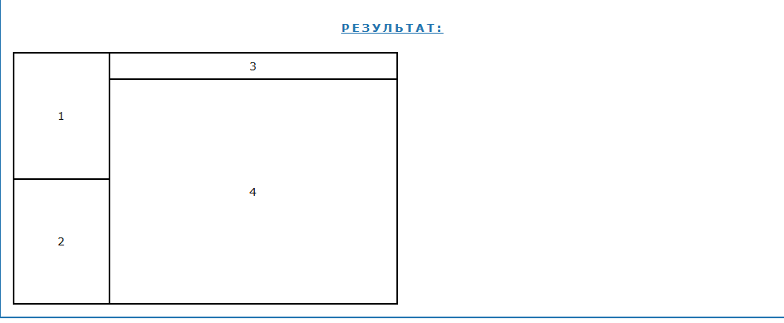
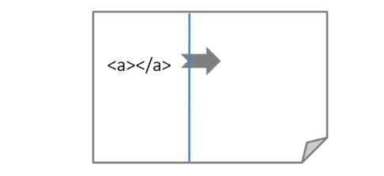
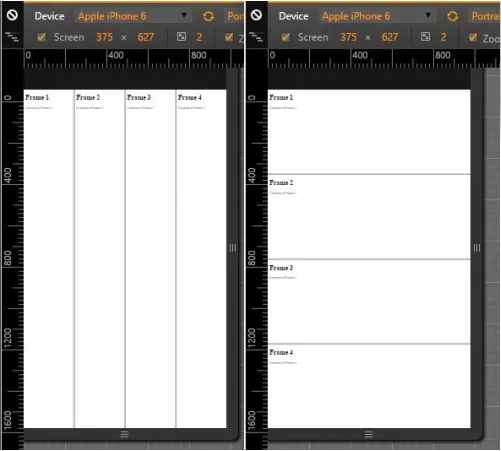

# Frames в HTML
### Фреймы в HTML похожи на таблицы, но в отличие от них, каждый фрейм независим и в каждом из них может быть отдельная веб-страница со своим адресом.

## Для работы с фреймами применялись следующие теги и атрибуты:

Тег \<frameset>. Используется для разделения экрана. Среди атрибутов тега: cols (деление по вертикали), rows (деление по горизонтали), frameborder (наличие рамок), border (ширина рамки), bordercolor (цвет рамок). 2
Тег \<frame>. Определяет, что именно должно отображаться в конкретном фрейме. Среди атрибутов тега: src (адрес содержимого, которое будет отображаться во фрейме), name (имя фрейма), scrolling (наличие полос прокрутки), noresize (не позволяет пользователю изменять размер рамки). 21
В HTML5 фреймы заменили тегом \<iframe> и современными методами вёрстки, такими как Flexbox и CSS Grid.  1

W3C признала фреймы устаревшими в HTML5. Решение было аргументировано тем, что фреймы HTML отрицательно сказываются на удобстве использования и доступности. 

## Атрибуты тега \<frameset>
cols - делит экран по вертикали. Принимает значения в пикселях, в процентах или просто *. Значение * говорит о том, что конкретный столбец будет занимать всю остальную часть экрана

rows- делит экран по горизонтали. Принимает значения в пикселях, в процентах или просто *. Значение * говорит о том, что конкретная строка будет занимать всю остальную часть экрана.

frameborder - определяет наличие рамок, т.е. границ фреймов. Принимает значения "yes" или "no"

border - ширина рамки в пикселях

bordercolor - цвет рамок. По умолчанию (если используется стандартная цветовая схема системы Windows) границы фреймов имеют тусклый, серый оттенок. Но при желании можно выбрать любой другой цвет. При определении цвета можно выбрать как его название, так и числовой эквивалент в системе RGB. Например, blue или #0000ff
В отдельном теге \<frameset> имеет смысл использовать только один из атрибутов – cols или rows. Это означает, что фреймовая структура будет состоять или только из столбцов, или только из строк. Чтобы создать строки внутри столбцов или столбцы внутри строк, вам потребуется вложенные контейнеры \<frameset>…<\/frameset>.

> \<frameset cols="25%,75%"  frameborder="yes" border="2">
  \<frameset rows="50%,50%" frameborder="yes" border="2"></frameset>
  \<frameset rows="10%,90%" frameborder="yes" border="2"></frameset>
\</frameset>

## Дополнительные атрибуты:

name — имя фрейма

frameborder — граница фрейма

scrolling — полоса прокрутки

hspace — отступы по горизонтали

vspace — отступы по вертикали

marginwidth — отступ внутренней страницы от границы фрейма по горизонтали

marginheight — отступ внутренней страницы от границы фрейма по вертикали

## Правила создания ссылки во фреймах в html
Если представить структуру, в которой слева находится фрейм с меню сайта, а справа фрейм, предназначенный для вывода содержимого выбранных пунктов меню, то становится очевидна следующая проблема:
при щелчке на пункте меню содержимое будет загружаться в тот же фрейм с меню, а не во фрейм, расположенный справа

## Как задавать стили для фреймов

Когда речь идет об определении стилей веб-страницы, которая использует фреймы в HTML, существуют два способа назначения стилей:

Определение стилей внутри каждого frame;
Определение стилей для frameset.
Представление каждого frame должно определяться внутри исходного документа. Представление frameset должно определяться внутри родительского документа, содержащего frameset. Другими словами, стили для frame_1.html должны задаваться правилами CSS, содержащимися в файле frame_1.html, или в таблице стилей, связанной с файлом frame_1.html.

## Указание фреймов с помощью ссылок

Одним из наиболее распространенных случаев использования фреймов является создание во фрейме "прилипающего" меню навигации, которое всегда видно независимо от положения содержимого других фреймов. При правильном применении, ссылки в меню навигации приводят к загрузке новых ресурсов во фрейме, в то время как остальные фреймы остаются статическими.

Можно отформатировать анкоры для указания конкретных фреймов через присвоение нужному элементу frame атрибута name и использование атрибута target внутри элемента a для загрузки href в указанном фрейме. Если все это немного сбивает вас с толку, давайте разберем процесс создания фреймов в HTML шаг за шагом.

Первым делом нам нужно присвоить name для фрейма, в котором должны открываться ссылки. В разметке, которую мы создали чуть ранее, можно использовать левый столбец для меню навигации, а центральный столбец в качестве целевого фрейма. Для этого нужно присвоить атрибут name целевому элементу:

## Как сделать фреймы адаптивными

При применении фреймов довольно сложно обеспечить удобство использования для посетителей, заходящих на сайт со смартфонов и небольших планшетов. Так как фреймы были полностью удалены из HTML5 и считаются устаревшими, важно, чтобы владельцы сайтов, созданных с использованием фреймов, запланировали перестройку своих ресурсов и переход на другие технологии.

## Использование строк, а не столбцов

Если это возможно, организуйте фреймы в ряды, а не столбцы. На маленьком экране гораздо легче перемещаться по контенту по вертикали, чем по горизонтали. Фреймы в HTML, которые расположены в ряд, намного проще просматривать на небольшом экране. Если мы уменьшим ширину макетов, содержащих строки и столбцы, имитируя экран Apple IPhone 6, то увидим, что строки намного удобнее просматривать, чем столбцы:

## Используйте проценты для ширины столбцов

Когда размеры столбцов задаются в процентах, а не в пикселях, они будут автоматически изменяться в зависимости от размера экрана устройства. Хотя это может создать определенные проблемы, связанные с тем, что некоторые фреймы могут стать слишком маленькими, но в целом опыт взаимодействия и просмотра будет лучше, если общая ширина столбцов задается в процентах, а не в пикселях.

## Почему тег \<frame> устарел?

> Тег \<frame> устарел, поскольку он вызывает значительные проблемы с удобством использования, доступностью и SEO. Он был заменен более современными подходами, такими как \<iframe> и CSS для целей компоновки.Тег \<iframe> и современные методы компоновки, такие как Flexbox и CSS Grid, заменили теги \<frame> и \<frameset>. \<iframe> позволяет встраивать контент, сохраняя при этом современные веб-стандарты.

## Как тег \<frame> повлиял на навигацию по сайту?

>Тег \<frame> часто приводил к путанице в навигации, поскольку каждый фрейм мог независимо загружать разный контент, из-за чего пользователям было сложно добавлять в закладки определённые страницы или эффективно использовать кнопки «Назад» и «Вперёд» в браузере.

## Проблема адресной строки при фреймовой структуре сайта

После загрузки этой страницы происходит загрузка информации во фреймы. Внутри этих фреймов происходят все переходы пользователя по страницам сайта. В адресной строке всегда отображается только путь к начальной странице, который не изменяется при переходах. Посетитель не знает, где он находится в данный момент.

Если посетитель сразу попадает не на главную страницу сайта (например, из поисковика), то это не приводит к воссозданию общей структуры фреймов. Это является причиной того, что владелец сайта не может указать адрес на внутреннюю страницу сайта.

Есть несколько путей решения этой проблемы

Ранее был рассмотрен пример фреймовой структуры. Будем рассматривать различные способы решения этой проблемы именно на нём.

Идея заключается в следующем: при загрузке страницы, содержащей информационную часть, будем проверять окружение страницы и, если требуемая фреймовая структура отсутствует - создадим её при помощи скрипта.

Возможны три случая:

1. Посетитель зашёл на страницу, содержащую фреймовую структуру;
2. Посетитель зашёл на одну из информационных страниц;
3. Посетитель попал на страницу с навигационным меню.

В первом случае после выполнения проверки никаких действий не требуется. Второй и третий практически идентичны, поэтому далее будем рассматривать только второй случай.

Итак, посетитель попадает "Куда не надо". В самое начало страницы вставляем скрипт, который будет создавать фреймовую структуру.

Реализация решения возможна как на стороне клиента, так и на стороне сервера.

