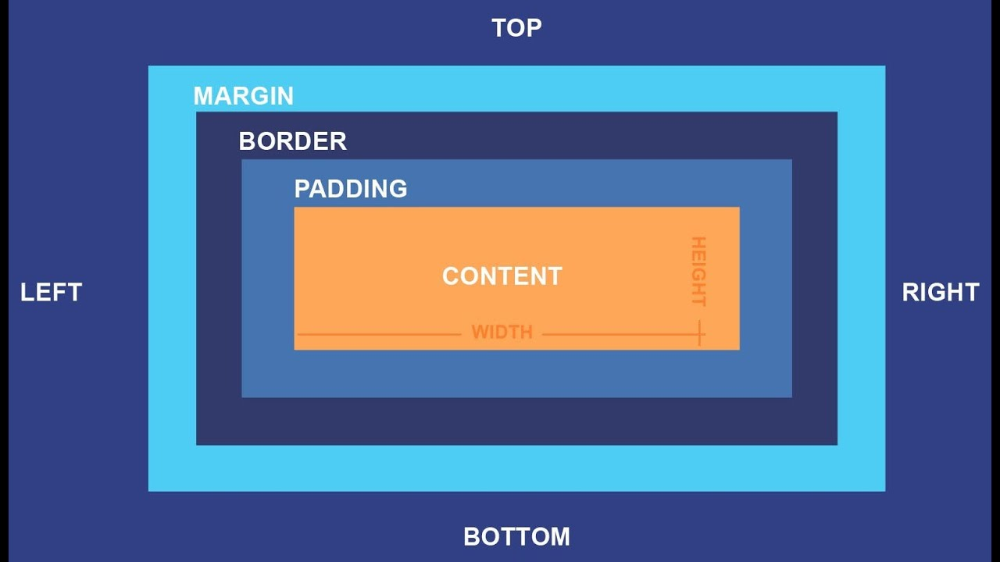
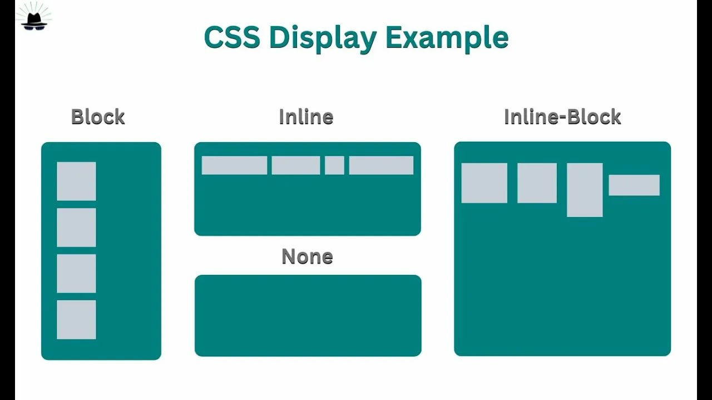
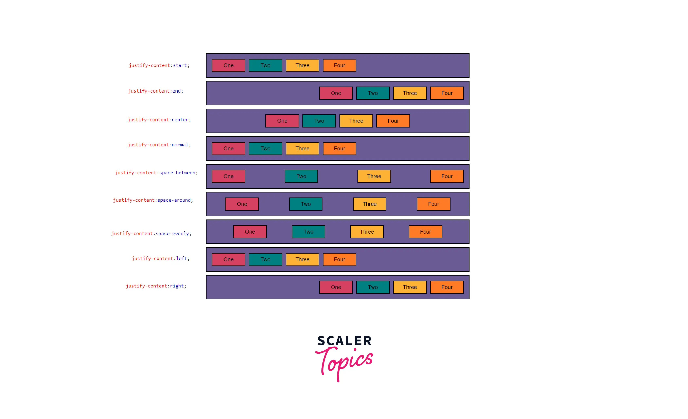

# Основы позиционирования
## Блочная модель

## План урока

1. Свойство display
2. Flexbox и Grid layout
3. Позиционирование блоков

# Свойство дисплей

### Значения свойства display

* none - скрыть
* block - блочный
* inline - строчный
* inline-block - строчно-блочный
* flex гибкий
* grid layout сетка

### Значение inline-block

```
Элемент находится в строке, но при этом ему может быть задано значение ширины и высоты.
```
 ```
 Можно задавать свойства width, height.

 Является частью строки.

 Размер устанавливается по содержимому, если не заданы значенрия ширины и высоты.

 Элемент всегда прямоугольный.
 ```
### Значение flex 

```
Наделение контейнера способностью изменять ширину или высоту для поддержки всех видов дисплеев и разных разрешения экранов
```

1. Элементы могут сжиматься и растягиваться, занимая необходимое пространство
2. Возможное выравнивание не только по вертикали, но и по горизонтали
3. Элементы могут автоматически вырастраиваться в несколько строк
4. Возможность формирования блоков справа налево

### Основы flexbox



cross(перекресток) - распределение по вертикали

### Синтаксис CSS
1. Главная ось (main axis) и перпендикулярная ось (cross axis)
2. начало (main-start) и конец (main-end) направления главной оси
3. main size и cross size - ширина или высота flex-элемента
4. cross-start и cross-end - начало и конец вертикальной оси


justify-content:flex-start
```
div1 div2 div3 div4 div5
```

justify-content:center;
```
span2 span3 span4 span5
```
justify-content:flex-end;
```
div div div div div
```
justify-content:space-between;
```
span span span span span
```
justify-content:spacy-around;


* flex-start: элементы выравниваются по левой стороне контейнера.
* flex-end: элементы выравниваются по правой стороне контейнера.
* center: элементы выравниваются по центру контейнера.
* space-between: элементы отображаются с одинаковыми отступами между ними.
* space-around: элементы отображаются с одинаковыми отступами вокруг них.

## flex-wrap
* nowrap: размеры элементов устанавливаются автоматически, чтобы они поместились в один ряд.
* wrap: элементы автоматически переносятся на новую строку.
* wrap-reverse: элементы автоматически переносятся на новую строку, но строки расположены в обратном порядке.

* flex-start: ряды группируются в верхней части контейнера.
* flex-end: ряды группируются в нижней части контейнера.
* center: ряды группируются вертикально по центру контейнера.
* space-between: ряды отображаются с одинаковыми расстояниями между ними.
* space-around: ряды отображаются с одинаковыми расстояниями вокруг них.
* stretch: ряды растягиваются, чтобы заполнить контейнер равномерно.

Тренировочный сайт - Flexboxfroggy

### Основы grid
#### Особенности grid 
1. распределение элементов не только горизонтально, но и вертикально
2. Объединение ячеек по горизонтали и вертикали
3. гибкая адаптивная сетка для создания проектов любой сложности
4. хорошая поддержка браузерами

### Основные понятия 
1. Линии сетки (grid lines) - это неввидимые горизонтальные и вертикальные разделительные линии
2. Дорожка сети (grid track) - пространство между двумя соседними линиями сетки
3. Ячейки сетки(grid cell) - пространство, ограниченное четырьмя линиями сетки
4. Элементы сетки (grid items) - отдельные элементы,которые назначаются областями стеками

#### Колонки 
grid-tamplate-columns создание сетки из колонок
#### Столбцы
grid-template-rows создание сетки из строк
#### Отступы
gap промежутки между элементами

## Единицы измерения 
px

%

fr

auto

*Grid garden - второй тренажер* 

## Позиционирование
Позволяет точно определить,
где появятся блоки
относительно окна браузера
или других объектов на
веб-странице.

### Position

1. static-нормальное (по умолчанию)
2. relative-относительное
3. absolute-абсолютное
4. fixed-фиксированное
5. inherit-наследует значение родителя

### Свойства смещения

left: 20px;

right: 50px;

top: 25em;

bottom: 60%;