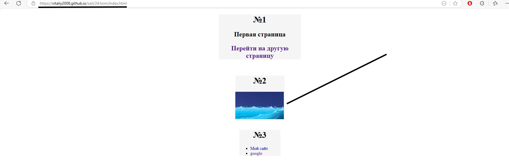

# Проверка домашнего задания Пензаря Виталия

## Нас конкретно интересует тут 2-ое задание,суть его была в том,чтобы установить ссылку на другую страницу и переход должен был осуществиться через фотографию,но нас не перебрасывает на другую страницу

## Проблема заключается в том,что неверно указана ссылка в href,а именно стоит путь,который указан у автора работы на компьютере и следовательно ни у кого он не будет работать,для этого нужно было указать ../index.html и тогда выход осуществился бы. (Изначально фото с ссылкой находится в папке,а файл,на который хотим перейти вне папки)

## В 7 задании должны быть анкера.Нажимаешь на букву и тебя кидает на определения

## Соответственно вот и условие задания

