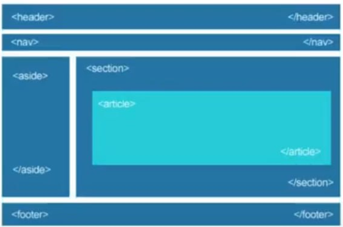
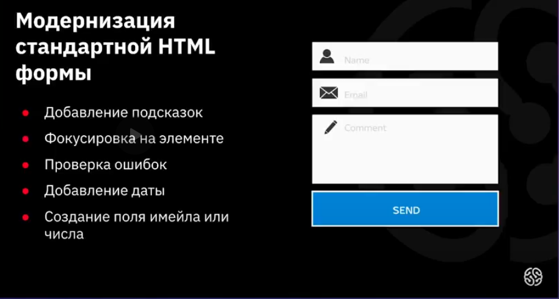

# Новые возможности html5
 ## План урока

 1. Новые симантические элементы
 2. Модерация стандартной html формы
 3. Добавление аудио и видео на страницу 

 # Новые симантические элементы
## Для чего необхдим новый способ структурирования страниц?
1. Более удобное редактирование и споровождение 
2. Оптимизация поисковых движков
3. Поддержка будущих возможностей 
## Симантические элементы для работы со структурой страниц 
### \<header>
Шапка сайта или раздела, в которой может распологаться один или несколько заголовков, группа навигационных цепочек, информация об авторе.

### \<nav>
Группа навигационных
цепочек (меню сайта).

### \<main>
Основное, уникальное для каждой
страницы, содержимое сайта.

### \<footer>
Подвал сайта или раздела,
где может содержаться
информация об авторе.
навигационная цепочка
или контактная информация.

### \<section>
Логическая область страницы,
применяется для новостей, блоков
информации. Раздел чаще всего
содержит заголовок.

### \<article>
Раздел контента, который
образует независимую часть
документа или сайта,
например, статья в журнале,
запись в блоге, комментарий.

### \<figure>
Тег-контейнер для
иллюстрации или диаграммы,
обычно с подписью
\<figcaption>.

### \<aside>
Контент страницы, который можно
убрать со страницы без потери
смысла для сайта.

### \

Виджет, который пользователь
может открыть или закрыть.

### \

В этот тег заключается текст, который необходимо скрыть.
## Устройство сайта

# Семантические элементы для работы с текстом

### \<time>
Определяет дату, время, например
для выделения даты создания
статьи или контента, регистрации
на сайте.

### \<wbr>
Место разрыва длинной
строки.

# Усовершенствование традиционных форм

# HTML5 Аудио и Видео

HTML5-элемент \<audio> используется для внедрения звукового
контента в веб-страницы.

### controls
Добавляет отображение
браузерами интерфейса управления
аудио плеера - кнопки
воспроизведения, паузы, громкости

### autoplay
Автоматически запускает
на странице аудиофайл.

### loop
При завершении композиции она
запустится вновь.

### muted
Отключает звук.

### preload
Какую часть аудиофайла требуется
загрузить браузеру для ускорения
запуска аудиозаписи.

### scr
Указывает путь к файлу.

## Воспроизведение видео

С помощью элемента \<video>появилась возможность
добавлять видео-содержимое
на веб-страницы, а также
стилизовать внешний вид
видео-плеера при помощи
css-стилей.

Ter \<video>, применяет такие же атрибуты src, controls, autoplay и loop,
которые мы рассмотрели ранее.

\<poster> Выставляет изображение, которое браузер будет использовать,
пока браузер загружается.

## Атрибут preload
### auto
Браузер загружает видеофайл
полностью, чтобы он был доступен,
когда пользователь начнет его
воспроизведение.

### metadata
Браузер загружает первую
небольшую часть
видеофайла, чтобы
определить его основные
характеристики.